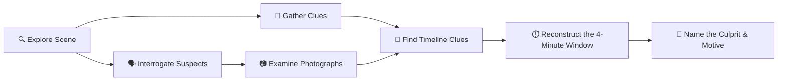

# 🍲 Onam Heist (ഓണം ഹെയ്‌സ്റ്റ്)

> **An atmospheric point-and-click interactive mystery game set in a traditional Kerala home on Thiruvonam day.**

Built using **Figma Make** for the **Friends of Figma (FoF) Kochi Make-a-thon — Onam Edition**, held on **August 16** at **TinkerSpace Kochi**.

---

## 🌟 The Mystery

It is **Thiruvonam at 12:41 PM**.

The grand Onam Sadya is laid out across the banana leaf, nearly complete with every traditional delicacy in its rightful place. But in the brief four-minute window between **12:38 PM** and **12:42 PM**, the central vessel of sweet **Payasam** vanished from the leaf.

Six people were in the house. Everyone has an alibi, but someone's timeline doesn't match up. Step into the shoes of the family detective: inspect the room, uncover clues, interrogate the suspects, cross-reference Anu's photographs, reconstruct the sequence of events, and solve the Onam Heist!

---

## 🎮 Gameplay Features



1. **Interactive SVG Scene Diorama**:
   - Explore an authentic Kerala dining room featuring teak wood flooring, a Nilavilakku lamp, festive Pookkalam floral art, and the traditional Sadya spread.
   - Smooth cinematic zoom-and-pan camera effects when focusing on objects or suspects.

2. **Visual Attire & Identification System**:
   - Every character wears signature festive attire with distinct color palettes.
   - Use these visual cues to identify people across the room and spot who was where in Anu's snapshot photographs!

3. **Dialogue & Interrogation**:
   - Question the family members and visitors to hear their stories and observe their quiet tells.
   - Gated dialogue options unlock as you collect physical evidence or discover photographic details.

4. **Timestamped Photo Album**:
   - Inspect photographs taken throughout the morning to piece together spatial positions and activities.

5. **Timeline Reconstruction & Deduction**:
   - Map your findings across the critical 12:38 PM – 12:42 PM window to formulate your final deduction.

---

## 👥 The Suspects

* **Ammachi** — *Grandmother · Organised the feast*
* **Appa** — *Father · Stepped out for an urgent phone call*
* **Anu** — *Niece · Documented the morning with her camera*
* **Kunjumol** — *Kitchen Helper · Cooking over the stove*
* **Uncle** — *Ammachi's Brother · Arrived through festive traffic*
* **Neighbour** — *Family Friend · Stopped by to return a borrowed vessel*

*(Can you spot whose story doesn't add up?)*

---

## 🛠️ Technology Stack

- **Framework**: [React 19](https://react.dev/) & [TypeScript](https://www.typescriptlang.org/)
- **Styling**: [Tailwind CSS v4](https://tailwindcss.com/) with `@tailwindcss/vite`
- **Typography**: Google Fonts — [Lora](https://fonts.google.com/specimen/Lora) (Serif) & [Outfit](https://fonts.google.com/specimen/Outfit) (Sans-Serif)
- **Visuals**: Pure Vector SVG with dynamic lighting gradients and procedural patterns
- **Build Tool**: [Vite 8](https://vite.dev/)
- **Platform**: Built with **Figma Make**

---

## 📂 Project Architecture

```
heistt/
├── .figma/
│   └── make/
│       ├── dev.json            # Figma Make dev configuration
│       └── site.json           # Site metadata, title & description
├── public/                     # Static assets
├── src/
│   ├── components/
│   │   ├── DiningScene.tsx     # 1400x900 SVG room scene & camera transitions
│   │   ├── EvidenceDrawer.tsx  # Slide-out inventory of collected clues
│   │   ├── FinalAct.tsx        # Timeline reconstruction & deduction climax
│   │   ├── InspectAnnotation.tsx # In-scene object inspection modal
│   │   ├── Interrogation.tsx   # Suspect dialogue & questioning interface
│   │   ├── PhotoViewer.tsx     # Anu's photo gallery viewer
│   │   ├── StartScreen.tsx     # Opening briefing modal
│   │   └── SuspectArt.tsx      # SVG character busts, presences & polaroid scenes
│   ├── App.tsx                 # Core game state orchestrator & phase machine
│   ├── gameData.ts             # Clues, context objects, coordinates & hitboxes
│   ├── index.css               # Global CSS, theme tokens & custom animations
│   ├── main.tsx                # React DOM root entrypoint
│   ├── suspects.ts             # Suspect dossiers, dialogue trees & photo metadata
│   └── vite-env.d.ts           # Vite TypeScript definitions
├── index.html                  # HTML template shell with Figma Make slots
├── package.json                # Project dependencies and npm scripts
├── tsconfig.json               # TypeScript configuration with path aliases
└── vite.config.ts              # Vite configuration & Figma Make plugins
```

---

## 🚀 Getting Started

### Prerequisites
- **Node.js**: `v20.0.0` or higher
- **Package Manager**: `pnpm` (recommended), `npm`, or `yarn`

### Installation & Run

1. **Clone the repository:**
   ```bash
   git clone https://github.com/ClashLex/Heist.git
   cd Heist
   ```

2. **Install dependencies:**
   ```bash
   pnpm install
   # or: npm install
   ```

3. **Start the development server:**
   ```bash
   pnpm dev
   # or: npm run dev
   ```
   Open `http://localhost:8443` in your browser.

4. **Build for production:**
   ```bash
   pnpm build
   # or: npm run build
   ```

---

## 🏆 Event Credits

* **Event**: [Friends of Figma (FoF) Kochi](https://friends.figma.com/kochi/) Make-a-thon — Onam Edition
* **Date**: August 16, 2026
* **Venue**: [TinkerSpace Kochi](https://tinkerspace.in/), Kerala, India
* **Theme**: Onam Festival, Interactive Fiction, Visual Storytelling & Figma Make

---

## 📄 License

This project is open-source and available under the [MIT License](LICENSE).
